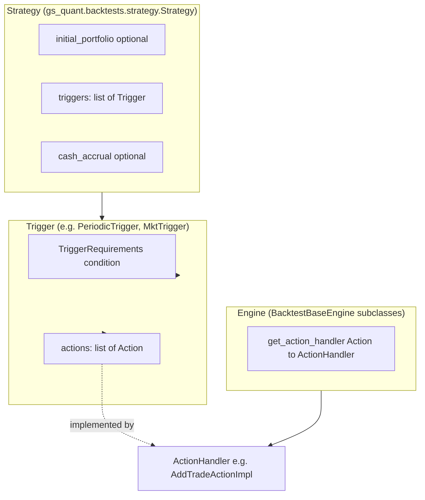

# gs-quant Backtesting — System Architecture

This document describes how backtesting is structured in **gs-quant**: how strategies obtain data, how **Trigger**, **Action**, **Strategy**, and **Engine** relate, what happens when **`GenericEngine.run_backtest`** runs, and where you can plug in local data (for example SQLite) instead of Goldman Sachs cloud APIs.

**Existing documentation (summarized here):**

- **`gs_quant/backtests/SKILL.md`** — Practical guide: engine choice, trigger/action catalog, `GenericEngine` parameters, and examples. This file is the main user-facing backtest guide.
- **`gs_quant/documentation/04_backtesting/`** — Tutorials and notebooks (walkthroughs, predefined-asset examples). They demonstrate usage rather than internal call graphs.

The sections below **bridge gaps** by tracing **source-level** control flow and extension interfaces.

---

## 1. Mental model: three “tiers” of backtest

The repository implements **more than one** backtest style. They share the names **Strategy**, **Trigger**, and **Action**, but **not** the same pricing or data stack.

| Tier | Primary entry points | How “market data” and pricing work |
|------|----------------------|-------------------------------------|
| **A. Generic (OTC / multi-asset)** | `GenericEngine.run_backtest` | **GS Marquee pricing/risk APIs** via `PricingContext` → `GenericRiskApi` / `RiskApi` (HTTP / batch / websockets). No separate `MarketData` class in `backtests`; “market” is implicit in **`Portfolio` / instrument `.calc(risk)`**. |
| **B. Predefined assets / execution-style** | `PredefinedAssetEngine.run_backtest` | **Local time series** in a `DataManager` (`DataSource` / `GenericDataSource`), accessed through `DataHandler` with a **causal clock** (no lookahead). Mark-to-market uses those fixings, not full OTC pricers. |
| **C. Equity vol / hosted service** | `EquityVolEngine`, `StrategySystematic.backtest` | **Server-side** backtests via `GsBacktestApi` (remote jobs). Different code path from `GenericEngine`. |

Most documentation refers to **tier A (`GenericEngine`)**. Tiers B and C are alternative engines selected explicitly or via `Strategy.get_available_engines()`.

---

## 2. Object hierarchy

### 2.1 Core composition

- **`Strategy`** (`gs_quant/backtests/strategy.py`): Holds an optional **`initial_portfolio`**, a list of **`Trigger`**, optional **`cash_accrual`**, and aggregates extra **`risks`** from triggers (`get_risks()`).
- **`Trigger`** (`gs_quant/backtests/triggers.py`): Wraps **`TriggerRequirements`** (the *condition*) and one or more **`Action`** instances (the *effects*). `Trigger.has_triggered(state, backtest)` delegates to `trigger_requirements.has_triggered(...)`.
- **`TriggerRequirements`**: Many types (periodic, intraday, market level, portfolio/risk barriers, aggregates, etc.). They return **`TriggerInfo(triggered, info_dict?)`** where `info_dict` can pass structured hints to actions (for example `AddTradeActionInfo` with `next_schedule`).
- **`Action`** (`gs_quant/backtests/actions.py`): Declarative description of what to do (`AddTradeAction`, `HedgeAction`, …). The engine does **not** mutate the portfolio directly from the `Action` object; it uses an **`ActionHandler`**.
- **`BacktestBaseEngine`** (`gs_quant/backtests/backtest_engine.py`): Abstract **`get_action_handler(action)`** only.
- **Concrete engines** (`GenericEngine`, `PredefinedAssetEngine`, …): Supply a factory mapping **Action type → `ActionHandler` implementation**.

### 2.2 Strategy ↔ Engine selection

`Strategy.get_available_engines()` (`strategy.py`) instantiates a list of engines (`GenericEngine`, `PredefinedAssetEngine`, `EquityVolEngine`) and keeps those for which **`supports_strategy`** returns true. **`supports_strategy`** tries to resolve an **`ActionHandler`** for every action on every trigger; unknown action types fail the check.

---

## 3. Data flow: how a strategy gets data

There is **no single class named `MarketData`** in the backtest package. Data reaches a strategy through **different mechanisms** depending on engine and trigger type.

### 3.1 `GenericEngine`: pricing and risk (“market” = pricing service)

1. **`GenericEngine.run_backtest`** enters **`PricingContext`** (`new_pricing_context()` in `generic_engine.py`) with parameters such as **`market_data_location`**, **`csa_term`**, **`is_batch`**, **`use_historical_diddles_only=True`**, etc.
2. For each valuation date, the engine builds or updates **`Portfolio`** objects and calls **`Portfolio.calc(tuple(risks))`** (and related paths) inside nested **`PricingContext(pricing_date=...)`** or **`HistoricalPricingContext(dates=...)`** contexts.
3. **`PricingContext`** (see `gs_quant/markets/core.py`) batches work and dispatches to a **`GenericRiskApi`** implementation (default **`RiskApi`** stack in `gs_quant/api/risk.py`), using **`GsSession`**. That is the **cloud analytics / pricing** path—not a pluggable local “market data file” in the backtests layer.

So for **instrument PV and risk**, “market data” is whatever the **remote pricing stack** loads for the given **`market_data_location`** and pricing date. The backtest code does not inject a `MarketData` object; it relies on **`PricingContext`** + **instrument pricing**.

### 3.2 `GenericEngine`: trigger-level series (signals, barriers, events)

Triggers that need **time series** use **`DataSource`** (`gs_quant/backtests/data_sources.py`):

- **`GsDataSource`**: Uses **`Dataset`** (`gs_quant/data/dataset.py`) with default **`GsDataApi`** unless you pass a custom **`DataApi`** into **`Dataset(..., provider=...)`**. Intended path is **cloud dataset queries**.
- **`GenericDataSource`**: Wraps a **`pandas.Series`** indexed by date/datetime; **`get_data(state)`** returns a scalar. **Fully local** once the series is in memory.
- **Custom `DataSource`**: Subclass **`DataSource`** and implement **`get_data`** / **`get_data_range`**. This is the natural hook for **SQLite-backed** trigger inputs (load/query in `get_data`).

Examples of **who calls `get_data`**:

- **`MktTriggerRequirements.has_triggered`** calls **`self.data_source.get_data(state)`** and compares to **`trigger_level`** (`triggers.py`).
- **`MeanReversionTriggerRequirements`** uses **`get_data_range`** and **`get_data`**.
- **`EventTriggerRequirements`** may default to **`GsDataSource`** for macro calendar datasets.

**Risk-based triggers** (`RiskTriggerRequirements`) do **not** read a `DataSource` for the barrier; they read **`backtest.results[state][risk]`**, which must already exist from **`Portfolio.calc`**.

### 3.3 `PredefinedAssetEngine`: local fixings for MTM and triggers

- **`DataManager`** maps **`(frequency, instrument.name fragment, ValuationFixingType)`** → **`DataSource`** (`data_sources.py`).
- **`DataHandler`** enforces **causal access** (`Clock`): you cannot read data at a time before the simulated clock (`data_handler.py`).
- **`PredefinedAssetBacktest.mark_to_market`** (`backtest_objects.py`) uses **`data_handler.get_data`** / **`get_data_range`** for fixings when valuing holdings.

This path is **designed for local series** (including **`GenericDataSource`** built from data you loaded from SQLite yourself).

---

## 4. The loop: `GenericEngine.run_backtest`

Implementation: **`GenericEngine.run_backtest`** → **`__run`** in `gs_quant/backtests/generic_engine.py`.

### 4.1 Outer shell: `run_backtest`

1. Logs start; optionally enables tracing (`Tracer`).
2. Stores pricing parameters in **`_pricing_context_params`** (progress, CSA, visibility, **`market_data_location`**, batching).
3. **`with self.new_pricing_context():`** — installs the ambient **`PricingContext`** for all nested pricing.
4. Calls **`__run(...)`** with strategy, schedule parameters, risks, cash options, etc.

### 4.2 `__run`: step-by-step

1. **Build state schedule**  
   - If **`states`** is `None`: **`RelativeDateSchedule(frequency, start, end).apply_rule(holiday_calendar=...)`**.  
   - Else: use the explicit **`states`** list.  
   - Sort dates; derive **`strategy_start_date`** / **`strategy_end_date`**.

2. **Merge trigger-specific dates**  
   For each **`trigger`**, append **`trigger.get_trigger_times()`** that fall inside **[start, end]** (for example periodic sub-dates), then **unique + sort**.

3. **Merge risk measures**  
   Union of: argument **`risks`**, **`strategy.risks`**, optional **`pnl_explain`** risks, and **`Price`** (or custom **`price_measure`**). Optionally re-parameterize risks in **`result_ccy`**.

4. **Allocate `BackTest`**  
   **`BackTest(strategy, strategy_pricing_dates, risks, price_risk, holiday_calendar, pnl_explain)`** — holds **`portfolio_dict`**, **`results`**, **`cash_payments`**, hedges, weighted trades, etc. (`backtest_objects.py`).

5. **`_resolve_initial_portfolio`**  
   Resolves and rolls forward initial positions; may **`Portfolio.resolve()`** under **`PricingContext(strategy_start_date)`**.

6. **`_build_simple_and_semi_triggers_and_actions`**  
   For triggers/actions that are **not** fully path-dependent (`CalcType.path_dependent`), scans all pricing dates, evaluates **`trigger.has_triggered(d, backtest)`**, and **`ActionHandler.apply_action(triggered_dates, backtest, trigger_info)`** for semi-deterministic actions.

7. **Filter in-range**  
   Restricts **`portfolio_dict`**, **`hedges`**, **`weighted_trades`** to **[strategy_start_date, strategy_end_date]**.

8. **`_price_semi_det_triggers`**  
   Bulk pricing: for each day in **`portfolio_dict`**, **`with PricingContext(day): portfolio.calc(risks)`**; also initial calcs for hedge / weighted-trade scaling portfolios under **`HistoricalPricingContext`**.

9. **Main date loop: `_process_triggers_and_actions_for_date`**  
   For each **`d`** in **`strategy_pricing_dates`**:  
   - Path-dependent **`Trigger`** / **`Action`** branches: may call **`__ensure_risk_results`** then **`apply_action`** for that date.  
   - **Hedge** and **weighted trade** scaling: additional **`HistoricalPricingContext`** calcs and portfolio updates, **`cash_payments`**.

10. **`_calc_new_trades`**  
    Second pass for instruments that appeared in the portfolio **without** prior risk rows; **`Portfolio(leaves).calc(risks)`** per day.

11. **`_handle_cash`**  
    Prices cash flows where needed (**`Portfolio.calc(price_risk)`**), optional **`trade_exit_risk_results`**, builds **`cash_dict`** with accrual model support.

12. **Transaction costs**  
    Aggregates **`transaction_cost_entries`** into **`backtest.transaction_costs`**.

13. **Return** the **`BackTest`** instance.

---

## 5. The loop: `PredefinedAssetEngine.run_backtest` (contrast)

File: `gs_quant/backtests/predefined_asset_engine.py`.

1. **`data_handler.reset_clock()`**; create **`PredefinedAssetBacktest`**, **`SimulatedExecutionEngine`**.  
2. Build **`timer`** (datetime grid from calendar + trigger times).  
3. **`_run`**: for each **`state`** in timer (often with **`tqdm`**):  
   - **`data_handler.update(state)`** — advances causal clock.  
   - Execution engine **`ping`** → **fill events**.  
   - **Market event**: for each trigger, **`has_triggered`**, **`apply_action`** → **orders**.  
   - **Order events** → execution.  
   - **Valuation event** (typically EOD): **`mark_to_market`** using **`DataHandler`** fixings.

This loop is **event-driven** and **local-data-centric**, unlike **`GenericEngine`**’s **`Portfolio.calc`**-centric batch pricing.

---

## 6. Extension points: SQLite (or other local stores) vs GS cloud

Below is a practical map of **what to override** depending on whether you need **trigger signals**, **dataset catalog access**, or **full OTC pricing**.

### 6.1 Lowest effort: keep `GenericEngine`, localize **trigger** inputs only

- Build **`pandas.Series`** from SQLite and wrap with **`GenericDataSource`**, or subclass **`DataSource`** and query SQLite in **`get_data` / `get_data_range`**.
- Use those in **`MktTriggerRequirements`**, **`MeanReversionTriggerRequirements`**, etc.
- **Instrument pricing** still goes to the **cloud** via **`PricingContext`**.

### 6.2 `PredefinedAssetEngine`: localize **all** fixings for MTM

- Populate **`DataManager`** with **`GenericDataSource`** (or custom **`DataSource`**) per instrument and fixing type; data can be loaded from SQLite at startup.
- No change to **`GsDataApi`** required for this engine’s valuation path.

### 6.3 Cloud **dataset** queries: inject a custom `DataApi`

- **`Dataset(dataset_id, provider=your_data_api)`** (`dataset.py`) — if **`GsDataSource`** or **`EventTriggerRequirements`** must read from a non-GS backend, implement **`DataApi`** (`gs_quant/api/data.py`: **`query_data`**, **`build_query`**, **`construct_dataframe_with_types`**, etc.). This is a **large surface area** (query shapes must match what **`GsDataApi`** would produce for those datasets).

### 6.4 Full offline **OTC pricing** for `GenericEngine`

The extension hook on the pricing side is **`PricingContext(..., provider=YourGenericRiskApi)`** (`markets/core.py`), where **`GenericRiskApi`** (`gs_quant/api/risk.py`) must implement **`populate_pending_futures`** and **`build_keyed_results`**. That effectively replaces the **GS risk engine** for instruments using that context—**not** a small patch; you are implementing an alternative to remote **`RiskApi`**.

You may also set **`provider`** on individual instruments where supported (**`PricingContext.calc`** uses **`instrument.provider` if set**).

### 6.5 Session / environment

- APIs inherit from **`ApiWithCustomSession`**; **`GsSession`** controls endpoints and credentials. Pointing “away from GS” typically means **custom session base URLs** and/or **custom `GenericRiskApi` / `DataApi`** implementations, not a single toggle in **`GenericEngine`**.

---

## 7. File index (quick reference)

| Area | Main modules |
|------|----------------|
| Strategy / triggers / actions | `gs_quant/backtests/strategy.py`, `triggers.py`, `actions.py` |
| Generic engine | `gs_quant/backtests/generic_engine.py`, `generic_engine_action_impls.py` |
| Predefined-asset engine | `gs_quant/backtests/predefined_asset_engine.py`, `data_handler.py`, `execution_engine.py` |
| Backtest state object | `gs_quant/backtests/backtest_objects.py` (`BackTest`, `PredefinedAssetBacktest`) |
| Trigger data sources | `gs_quant/backtests/data_sources.py` |
| Pricing context | `gs_quant/markets/core.py` (`PricingContext`, `HistoricalPricingContext`) |
| Risk API | `gs_quant/api/risk.py` |
| Dataset / `GsDataSource` | `gs_quant/data/dataset.py`, `gs_quant/api/gs/data.py` (`GsDataApi`) |
| User guide | `gs_quant/backtests/SKILL.md` |

---

## 8. Summary

- **Strategy** bundles **triggers**; each **Trigger** pairs **TriggerRequirements** with **Actions**. **Engines** map **Actions** to **ActionHandlers** and drive the simulation.
- **`GenericEngine`** gets “market” for pricing through **`PricingContext`** and **remote** risk APIs; **trigger** series use **`DataSource`** (**`GenericDataSource`**, **`GsDataSource`**, or subclasses).
- **`PredefinedAssetEngine`** gets fixings from **`DataManager`** / **`DataHandler`**—a **local, causal** path suited to **pandas/SQLite-backed** series.
- **`GenericEngine.run_backtest`** builds a date grid, materializes **`BackTest`**, applies triggers and actions in phases (semi-deterministic then path-dependent), runs **`Portfolio.calc`** repeatedly, then cash and costs.
- **SQLite** integration is **straightforward** for **trigger series** and **`PredefinedAssetEngine`** fixings; **replacing cloud OTC pricing** requires implementing **`GenericRiskApi`** (and likely custom session wiring), which is a **full alternate pricing backend**, not a small database swap.
